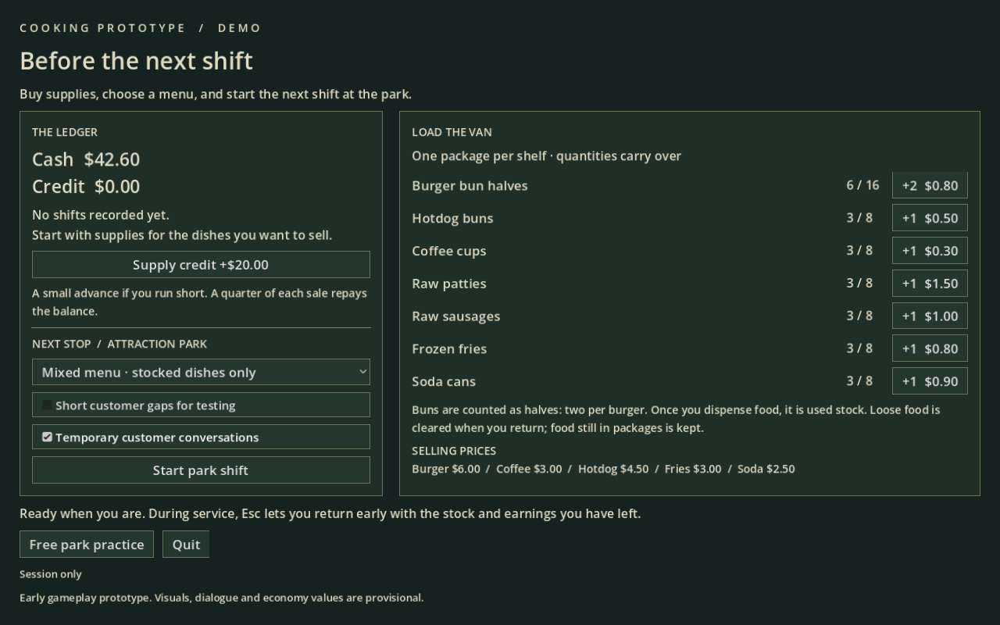
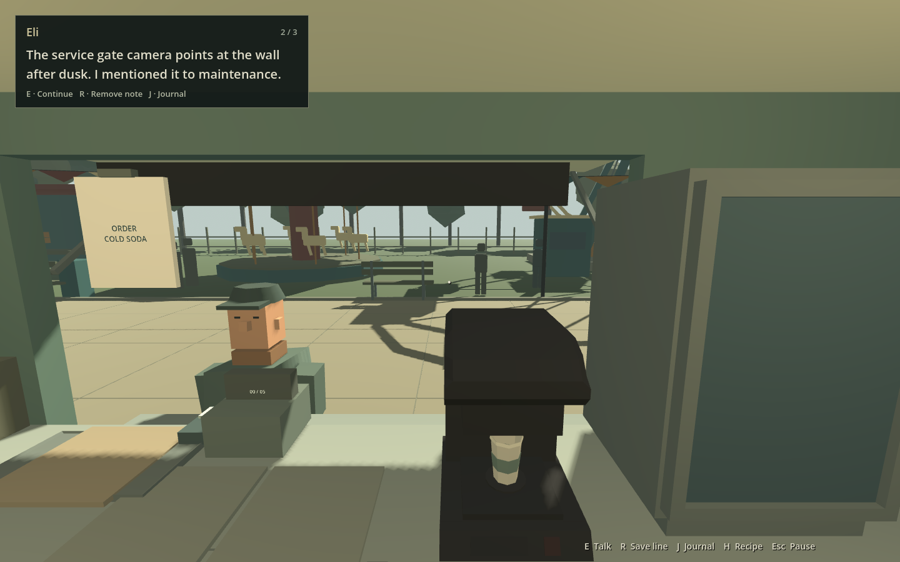

# Cooking Gameplay Prototype

An early personal project built with Godot 4, GDScript and Blender. This showcase focuses on a playable supply-management and cooking loop: **Hub → park shift → Hub**.

The visuals, characters, dialogue and economy are unfinished. This is a gameplay prototype, not a finished game.

## Gameplay video

https://github.com/user-attachments/assets/ca52c20a-9408-4102-979a-8733aac19199

One-minute recording of the supply hub, interior cooking interactions and return to the hub after a shift.

[Download the original recording (MP4)](https://github.com/OlegVarshavskiy/cooking-gameplay-showcase/releases/download/v0.1.0-demo/GamePlayDemoVideo.mp4)

## Play

Download the Windows demo from Releases, extract the ZIP and run `CookingPrototype.exe` (or `Play Hub.cmd`). No Godot or Blender installation is required.

Buy supplies at the Hub, choose a menu and begin a park shift. Recipe notes are available with H. Esc opens the pause menu and lets you end the shift and return to the Hub.

## Implemented work

- Data-driven items, slots and workstations with ownership and transfer logic.
- Cooking states, ingredient handling, order assembly and serving.
- Supply purchases, remaining stock, earnings and local persistence.
- Customer interactions and a visitor journal with temporary dialogue.
- Custom 3D assets created and integrated through Blender and Godot.

## Preview

